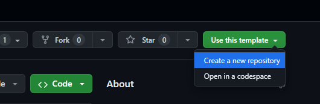
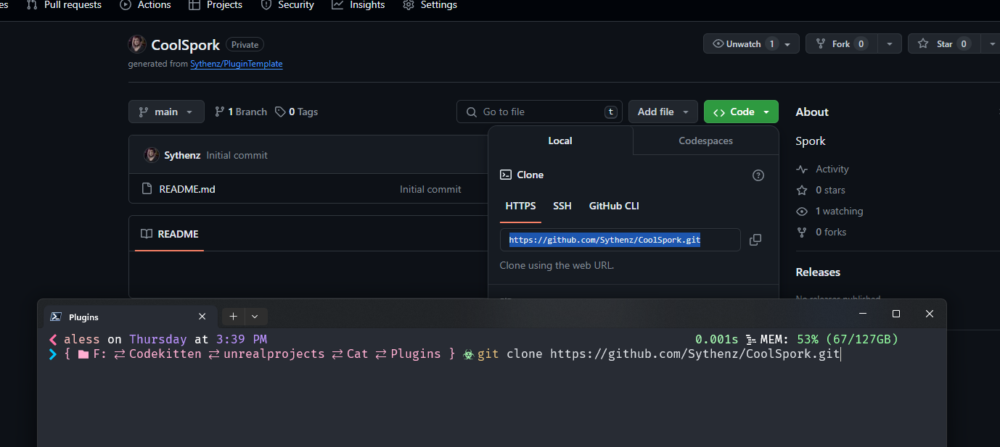
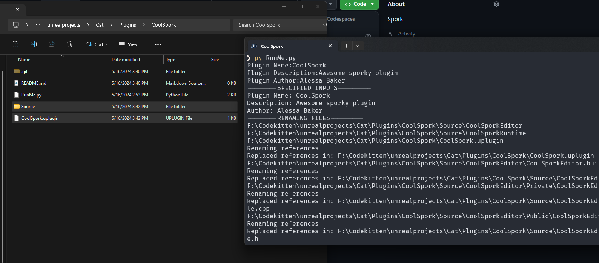

# Unreal Plugin Template

A hella simple Github template to use when creating a plugin, comes with a renaming script!
All you gotta do is:

- Go to the pluginTemplate on Github, and click "Use this Template" > "Create a New Repository"

- Clone your new repo to the directory of choice

- Navigate in your terminal of choice to the cloned directory and run run ``py RunMe.Py``

Give it a name, a Description and author name, and the plugin will rename and set everything
up for you.

After that, make sure to add your new plugin to your uproject and compile in your IDE of choice.

Alessa ❤️